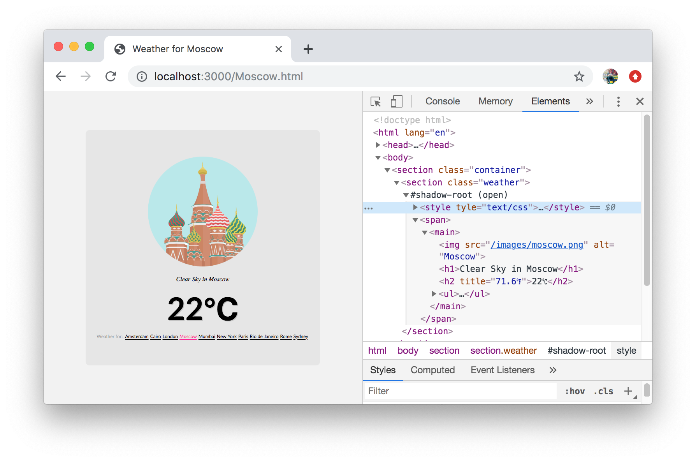

> Utilise Shadow DOM in React with all the benefits of style encapsulation.


&nbsp;

&nbsp;

&nbsp;


-   **npm**: `npm i react-shadow`
-   **yarn**: `yarn add react-shadow`
-   **Heroku**: [https://react-shadow.herokuapp.com/](https://react-shadow.herokuapp.com) ([https://react-shadow-2.herokuapp.com](alternative))



---

## Getting Started

Creating the [shadow root](https://www.w3.org/TR/shadow-dom/) is as simple as using the default export to construct a shadow root using the node name provided &ndash; for example `root.div` would create a `div` as the host element, and a shadow root as its immediate descendant &mdash; all of the child elements would then be descendants of the shadow boundary.

```jsx
import root from 'react-shadow';
import styles from './styles.css';

export default function Quote() {
    return (
        <root.div className="quote">
            <q>There is strong shadow where there is much light.</q>
            <span className="author">― Johann Wolfgang von Goethe.</span>
            <style type="text/css">{styles}</style>
        </root.div>
    );
}
```

[](https://codesandbox.io/s/react-shadow-by6bo?fontsize=14)

Applying styles requires either applying the styles directly to the component as a string, or importing the CSS documents as a string as part of your build process. You can then append the `style` component directly to your shadow boundary via your component's tree. In [the example](https://github.com/Wildhoney/ReactShadow/tree/master/example) we use the following Webpack configuration to import CSS documents as strings.

```javascript
{
    test: /\.css$/,
    loader: ['to-string-loader', 'css-loader']
}
```

Alternatively you can use [`styled-components`](https://www.styled-components.com/) normally, as each time a shadow boundary is created, a new `StyleSheetManager` context is also created which will encapsulate all related styles in their corresponding shadow root &mdash; to use this `import react-shadow/styled-components` instead of `import react-shadow`, likewise if you'd like to use [`emotion`](https://emotion.sh/docs/styled) you can `import react-shadow/emotion`.

```javascript
import root from 'react-shadow/styled-components';
import root from 'react-shadow/emotion';

// ...

<root.section />;
```

You may pass any props you like to the `root.*` component which will be applied directly to the host element, including event handlers and class names. There are also a handful of options that are used for the `attachShadow` invocation.

```javascript
ShadowRoot.propTypes = {
    mode: PropTypes.oneOf(['open', 'closed']),
    delegatesFocus: PropTypes.bool,
    styleSheets: PropTypes.arrayOf(PropTypes.instanceOf(global.CSSStyleSheet)),
    children: PropTypes.node,
};

ShadowRoot.defaultProps = {
    mode: 'open',
    delegatesFocus: false,
    styleSheets: [],
    children: null,
};
```

In cases where you need the underlying element and its associated shadow boundary, you can use a standard `ref` which will be invoked with the host element &ndash; from that you can use `shadowRoot` to access its shadow root if the `mode` has been set to the default `open` value.

```javascript
const node = useRef(null);

// ...

<root.section ref={node} />;
```

Recently and at long last there has been some movement in introducing a [declarative shadow DOM](https://tomalec.github.io/declarative-shadow-dom/) which `react-shadow` _tentatively_ supports &ndash; as it's experimental, open to sudden spec changes, and React finds it difficult to rehydrate &ndash; by using the `ssr` prop.

```javascript
const node = useRef(null);

// ...

<root.section ssr />;
```
